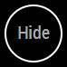

MMM-HideAll
===
[MagicMirror](https://github.com/MichMich/MagicMirror) Module to hide everything on screen.

### Screen shots

Different styles:

This is the default view


Keep the ring add a new symbol


````javascript
{
	module: 'MMM-HideAll',
	position: 'bottom_right'
	config: {
		symbol: "eye"
	}
},
````

Maybe a smile without the ring?


````javascript
{
	module: 'MMM-HideAll',
	position: 'bottom_right'
	config: {
		symbol: "smile"
	}
},
````

In your custome.css add the following rows.

````CSS
.hide-toggle{
	border: 0px solid #FFF;
}

.hide-toggle div{
	position: absolute;
		top: 0px;
		right: 0px;
		bottom: 0px;
		left: 0px;
	font-size: 55px;
}
````

The old default



````javascript
{
	module: 'MMM-HideAll',
	position: 'bottom_left',
	config: {
		hidetext: "Hide",
		showtext: "Show",
		symbol: ""
	}
},
````

Options for Setup:
---
* Add the following to your config:
````javascript
{
	module: 'MMM-HideAll',
	position: 'bottom_right'
	config: {
		hidetext: "",
		showtext: "",
		fadeSpeed: 1000,
		vishidden: 0.3,
		symbol: "hand-point-down"
	}
},
````

| Option | Description |
|---|---| 
|`hidetext`|The text on the hide button.<br>**Default value:** ``|
|`showtext`|The text on the show button.<br>**Default value:** ``|
|`fadeSpeed`|Speed of the fade.<br>**Default value:** `1000`|
|`vishidden`|How visual the "show" button shall be when everything else is hidden (0.0 - 1.0)<br>**Default value:** `0.3`|
|`symbol`|If you don't want text on your button, you can use any symbol from Font Awesome.<br>**Default value:** `hand-point-down`|

Once the module is loaded correctly, simple click or tap the 'Hide' button. Click it again to get everything back.

* Note

This requires the ability for you to click the button. It is not voice activated.
